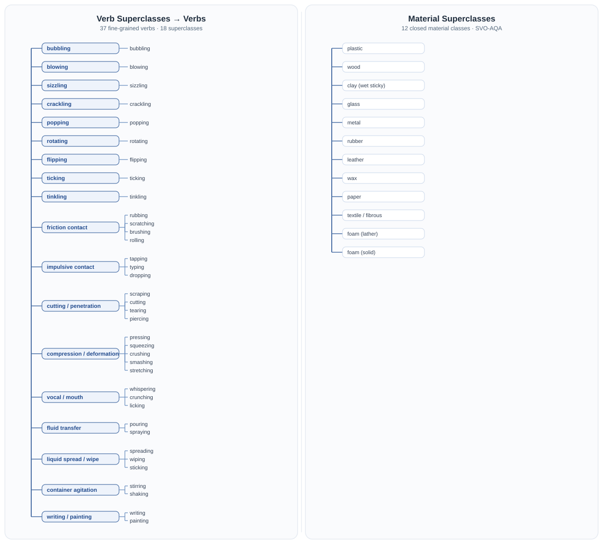

<div align="center">

# DeepASMR-NSpeech

### A Fine-Grained Benchmark for Non-Speech ASMR Generation

[](https://bonnie-yzy.github.io/DeepASMR-NSpeech/)
[](https://huggingface.co/datasets/yzyai/DeepASMR-NSpeech)
[](#citation)

**73,829 ten-second clips · 202.6 hours · 37 fine-grained actions · SVO-AQA**

</div>

---

Public data-construction, annotation, vocabulary, annotation-quality audit,
SVO-AQA, and test-set model-evaluation code for **DeepASMR-NSpeech**. Model
training/fine-tuning and the authors' private hand-labeled quality-control GT
are intentionally outside this release.

**Version:** 1.0.0  
**Authors:** Ziyi Yang, Leying Zhang, Chenda Li, and Yanmin Qian  
**Affiliation:** Auditory Cognition and Computational Acoustics Lab, Shanghai
Jiao Tong University

**Demo:** https://bonnie-yzy.github.io/DeepASMR-NSpeech/<br>
**Dataset:** https://huggingface.co/datasets/yzyai/DeepASMR-NSpeech<br>
**Paper:** Coming soon

<p align="center">
  <a href="https://bonnie-yzy.github.io/DeepASMR-NSpeech/#taxonomy">
    
  </a>
</p>

## Dataset at a glance

All released clips are 10 seconds long.

| Metric | Train | Test | Total / cross-split |
|---|---:|---:|---:|
| Source videos | 213 | 297 | 6 shared |
| Creators | 14 | 6 | 4 shared |
| Annotated events | 12,327 | 1,163 | 13,490 |
| Audio clips | 72,666 | 1,163 | 73,829; 0 overlap |
| Duration | 199.4 h | 3.19 h | 202.6 h |
| Embedded-audio Parquet | 95.711 GiB | 1.549 GiB | 97.260 GiB |

The vocabulary contains 37 fine-grained verbs grouped into 18 superclasses.

## What is included

| Area | Contents |
|---|---|
| `collection/` | YouTube metadata/audio ingestion, timeline parsing and fetching, timeline normalization/translation, segment cutting, keyframe extraction, and dataset assembly helpers |
| `annotation/train/` | Three-stage train annotation: vision description, text class+nouns, audio closed-set verb, then label export |
| `annotation/test/` | Test-set initialization, raw SVO extraction, SVO normalization, and public-label export |
| `annotation/**/prompts/` | Prompts used by the released annotation stages |
| `vocab/` | 37-verb taxonomy, material taxonomy, alias tables, and fine-grained disambiguation rules |
| `evaluation/annotation_quality/` | Blind stratified sampling, manual-GT comparison, optional noun adjudication, and inter-annotator agreement |
| `evaluation/model_benchmark/` | Multi-model test alignment; FD, FAD, KL, ISc, CLAP; SVO-AQA audio judging and subset selection |
| `benchmark/svo_aqa/` | SVO-AQA construction from human base annotations and generic MC prediction scoring |
| `demo/` | Static project-page resources, example media, workflow figures, and vocabulary-tree generator |
| `scripts/` | Hugging Face JSON staging, embedded-audio Parquet sharding, and upload helpers |

## What is not included

- model training or fine-tuning code;
- private hand-labeled GT used for annotation-quality analysis;
- private annotation-quality reports and LLM adjudication caches that may reveal GT;
- API keys, Hugging Face tokens, cookies, credentials, or machine-specific paths;
- the full audio dataset (publish it separately on Hugging Face).

## Installation

The exact validated environment is documented in
[`docs/reproducibility.md`](docs/reproducibility.md).

```bash
python3 -m venv .venv
source .venv/bin/activate
python -m pip install --upgrade pip
python -m pip install -r requirements-lock.txt
```

`ffmpeg` is required for audio/frame processing. `yt-dlp` is installed from the
Python requirements; Deno is recommended for current YouTube extraction.

## Quick start

### 1. Install and run offline tests

```bash
python -m unittest discover -s tests -v
```

The tests exercise run summaries, public-label export, Hugging Face staging,
blind manual-GT sampling, annotation-quality scoring, model-manifest alignment,
and SVO-AQA construction and scoring. They do not call paid APIs or download
media.

### 2. Run a three-item train-annotation smoke workflow

Prepare an event JSON following the schema in
[`annotation/README.md`](annotation/README.md), representative PNG frames named
`{id}_{start_sec}_{end_sec}.png`, and the audio paths referenced by each event.
Then set the API keys only in your shell:

```bash
export TRAIN_EVENTS_JSON=data/train_events.json
export TRAIN_FRAMES_DIR=data/train_frames
export SILICONFLOW_API_KEY="..."
export DASHSCOPE_API_KEY="..."

mkdir -p work/annotation_smoke

python3 annotation/train/stage1/run_stage1_vision.py \
  --source-json "$TRAIN_EVENTS_JSON" \
  --out-json work/annotation_smoke/train_events.json \
  --figs-dir "$TRAIN_FRAMES_DIR" \
  --limit 3 --no-enable-thinking --continue-on-error

python3 annotation/train/stage2/run_stage2_text_class_noun.py \
  --out-json work/annotation_smoke/train_events.json \
  --limit 3 --continue-on-error

python3 annotation/train/stage3/run_stage3_audio_verb.py \
  --out-json work/annotation_smoke/train_events.json \
  --limit 3 --continue-on-error

python3 annotation/train/export_train_label.py \
  --src-json work/annotation_smoke/train_events.json \
  --out-json work/annotation_smoke/train_label.json
```

These commands incur provider charges. Add `--dry-run` to an individual stage
to inspect its pending items without calling its API. Each stage checkpoints to
the shared working JSON and writes an adjacent operational summary.

## End-to-end data path

```text
public video/channel URLs
  -> audio + creator timelines
  -> timeline normalization and optional translation
  -> segment boundaries + clips + keyframes
  -> train/test annotation stages
  -> train_label.json / test_label.json
  -> human SVO-AQA base annotations
  -> SVO-AQA question bank
```

Every network/API stage writes a `*run_summary.json` containing input, success,
failure, skip counts, standardized reasons, and bounded failure details. These
are operational statistics only; they do not score annotation quality.

The public quality-audit code requires **independently hand-labeled GT**. It does
not treat model-generated labels as ground truth. See
[`evaluation/annotation_quality/README.md`](evaluation/annotation_quality/README.md).

See:

- [`collection/README.md`](collection/README.md)
- [`docs/annotation_protocol.md`](docs/annotation_protocol.md)
- [`docs/run_summaries.md`](docs/run_summaries.md)
- [`docs/svo_aqa_construction.md`](docs/svo_aqa_construction.md)
- [`docs/evaluation_protocol.md`](docs/evaluation_protocol.md)
- [`evaluation/annotation_quality/README.md`](evaluation/annotation_quality/README.md)
- [`docs/reproducibility.md`](docs/reproducibility.md)
- [`docs/licensing.md`](docs/licensing.md)
- [`docs/dataset_card.md`](docs/dataset_card.md)

## Build the Hugging Face release

The public dataset uses embedded-audio Parquet shards, matching the release
pattern used by DeepASMR. First stage the public JSON and benchmark artifacts,
then build approximately 1 GiB source-audio shards:

```bash
python3 scripts/prepare_deepasmr_nspeech_hf.py \
  --labels-only \
  --train-label /path/to/train_label.json \
  --test-label /path/to/test_label.json \
  --svo-aqa-source /path/to/mc_same_true \
  --out-root work/DeepASMR-NSpeech-dataset

python3 scripts/build_hf_parquet.py \
  --train-label /path/to/train_label.json \
  --test-label /path/to/test_label.json \
  --out-root work/DeepASMR-NSpeech-dataset \
  --target-shard-size-gib 1 \
  --resume

HF_REPO=yzyai/DeepASMR-NSpeech \
DATASET_DIR=work/DeepASMR-NSpeech-dataset \
bash scripts/upload_deepasmr_nspeech.sh
```

The Parquet builder embeds the audio bytes, exposes only anonymized creator
IDs, fails on missing files or duplicate/cross-split audio IDs, and can resume
after interruption.

## SVO-AQA scoring

```bash
python3 benchmark/svo_aqa/scripts/eval_mc.py \
  --bank DeepASMR-NSpeech-dataset/SVO-AQA/test_subset/bank.json \
  --predictions predictions.json \
  --out results/svo_aqa.json
```

Predictions may be a `question_id -> letter` JSON object or a list containing
`question_id` and `pred_label`.

The full bank contains 431 questions. The paper's main result uses the released
55-question audio-dependent subset. The public evaluator accepts three result
files and reports the 3-run mean for verb, verb-superclass, subject-material,
object-material, and macro accuracy.

## Test-set model evaluation

Generated audio from any model can be evaluated without publishing its
generation code. Put one `{audio_id}.wav` output per test item in each model
directory, define those directories in a local JSON registry, and build strict
aligned manifests:

```bash
python3 evaluation/model_benchmark/prepare_manifests.py \
  --labels DeepASMR-NSpeech-dataset/test/test_label.json \
  --dataset-root DeepASMR-NSpeech-dataset \
  --models work/models.json \
  --out-dir work/eval_manifests
```

The complete protocol covers:

- FD, FAD, KL divergence, Inception Score, and CLAP;
- SVO-AQA judging with the frozen DashScope model and decode settings;
- the 3-run reference-versus-silence rule used to freeze the 55-question
  audio-dependent subset; and
- strict audio-ID coverage checks so all models use the same test examples.

See [`evaluation/model_benchmark/README.md`](evaluation/model_benchmark/README.md)
and the frozen
[`paper_v1.json`](evaluation/model_benchmark/configs/paper_v1.json). Heavy metric
dependencies are pinned separately in `requirements-evaluation-lock.txt`.

## Secrets

Copy an `.env.example` to an untracked `.env`, or export keys in your shell.
Never commit `.env`, cookies, tokens, or credential files. See
[`SECURITY.md`](SECURITY.md).

## License and source-media rights

Code and original documentation in this repository are released under the
[`MIT License`](LICENSE). DeepASMR-NSpeech structured annotations, dataset
metadata, and SVO-AQA benchmark annotations that the authors are authorized to
license are released under
[CC BY-NC 4.0](https://creativecommons.org/licenses/by-nc/4.0/) (Hugging Face
identifier: `cc-by-nc-4.0`).

All copyright and associated rights in the original source videos, original
audio, and creator-produced content remain with their respective original
creators or other rights holders. Neither license transfers ownership of that
content or grants rights the authors do not hold. See
[`docs/licensing.md`](docs/licensing.md) and
[`THIRD_PARTY_NOTICES.md`](THIRD_PARTY_NOTICES.md).

<a id="citation"></a>

## Citation

Citation metadata is also available in [`CITATION.cff`](CITATION.cff).

```bibtex
@misc{yang2026deepasmrnspeech,
  title  = {DeepASMR-NSpeech: A Fine-Grained Benchmark for Non-Speech ASMR Generation},
  author = {Yang, Ziyi and Zhang, Leying and Li, Chenda and Qian, Yanmin},
  year   = {2026},
  note   = {Dataset and code, version 1.0.0}
}
```

Add the final venue, DOI, GitHub URL, and Hugging Face URL after publication.
Keep the dataset card, paper, and repository rights statements synchronized.
